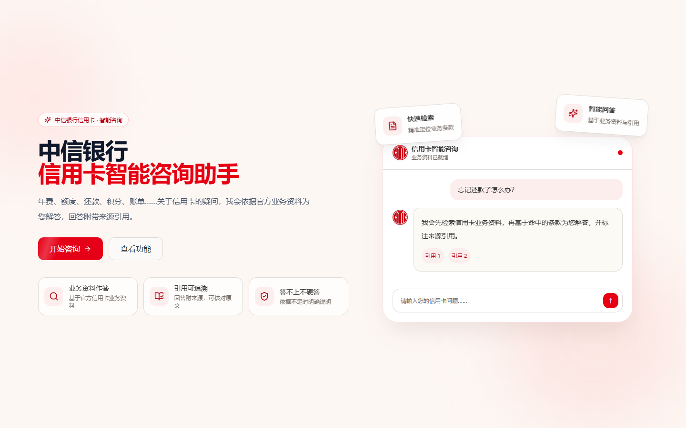
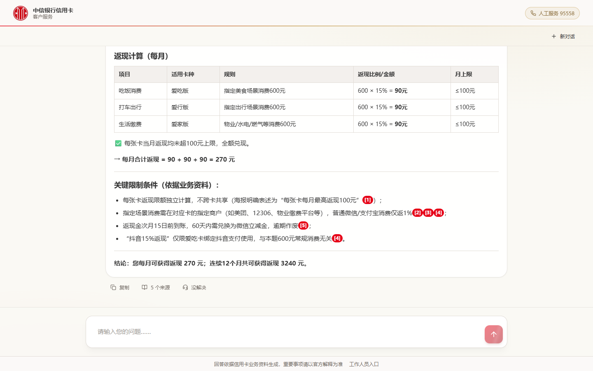
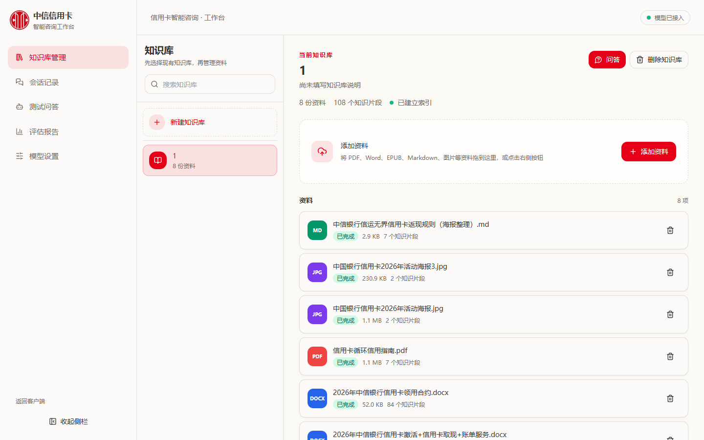
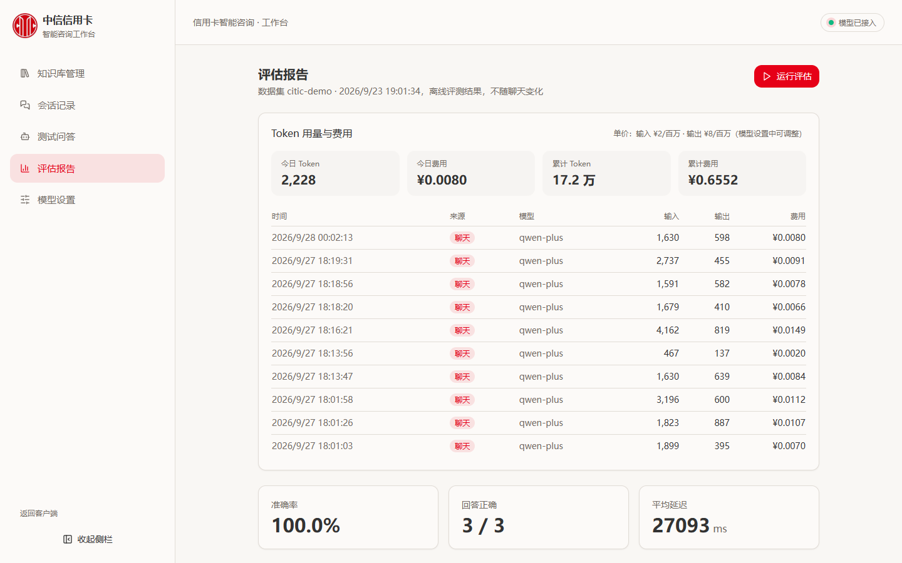

# 中信银行信用卡智能咨询助手

基于 RAG（检索增强生成）的银行客服问答系统，由"个人知识库"框架深度改造而来。面向真实使用场景设计：**答得准、说得清、答不了就老实说**——客户在前端提问，工作人员在后台管理知识库、跑评估、盯成本。



## 效果一览

| 客户端：结构化计算回答（带引用） | 工作台：知识库管理 |
| --- | --- |
|  |  |

| 工作台：评估报告 + Token 计费 |
| --- |
|  |

## 核心优势

- **严格依据业务资料回答**：只使用检索到的官方资料，依据不足时明确告知"资料中暂未说明"，涉及利息、年费等资金问题无依据时拒答并引导拨打 95558，绝不编数字
- **混合检索 + 本地精排**：向量检索管语义、BM25Plus 管精确数字，RRF 排名融合后由本地 ONNX Reranker（bge-reranker-base）精排，客户问题不出内网、零调用成本
- **对比/计算类问题自动出表格**：多卡、多场景、多档费率的问题自动整理成 Markdown 表格 + 关键限制条件 + 醒目结论；简单事实类问题保持简短文字回答
- **可评估、可计量**：内置离线评估闭环（关键词 + 引用双判据），三道由浅到深的测试题实测 3/3 = 100%（qwen-plus 真实运行）；Token 计费窗口按次记录输入/输出与费用
- **双端分离**：客户只看到服务，工作人员拿到全套运营工具；会话按客户/测试渠道分栏归档
- **确定性优先**：检索与精排全链路确定（同一问题证据与路由稳定一致），生成温度置 0

## 一分钟启动（Windows）

前提：已安装 Python 3.12+ 和 Node.js 20+（带 corepack）。

1. **双击 `start-local.cmd`**
2. 脚本会自动完成：创建后端虚拟环境并安装依赖（首次）→ 启动后端（127.0.0.1:8000）→ 启动前端（127.0.0.1:5173）→ 自动打开浏览器
3. 首次使用：进入 `http://127.0.0.1:5173/admin` → **模型设置**，填入你的阿里云百炼（DashScope）API Key，点"测试连接"确认接入
4. 在知识库管理页上传业务资料（DOCX / PDF / 图片 / Markdown），等待索引建立完成即可开始提问

只保留后端窗口也可以：后端会直接托管前端页面，访问 `http://127.0.0.1:8000`。

## 双端入口

- 客户端：`http://127.0.0.1:5173/` —— 无侧栏全屏聊天，回答带引用，依据不足时拒答并引导转人工（95558）
- 工作人员后台：`http://127.0.0.1:5173/admin` —— 知识库管理、会话记录、测试问答、评估报告、模型设置

## 检索链路

问题改写（多轮指代消解，失败回退原问题）→ 向量检索 + BM25 内存索引并行召回 → RRF 排名融合 → 本地 Reranker 精排 → LLM 生成带引用回答。

- 切分策略链：LLM 语义切分 → 结构切分（条款/问答/标题锚点）→ 中文递归切分护栏；策略写入 chunk 元数据 `split_strategy`
- BM25：对活跃 Chroma 集合建内存索引（BM25Plus），文档增删或索引切换时自动重建
- Reranker：默认本地 bge-reranker-base（ONNX，确定性打分；首次使用自动下载到 `backend/data/models/`）；设环境变量 `PKA_RERANKER_BACKEND=llm` 可切回 LLM 排序对照
- 资金安全：涉及费用、利率等问题在无业务资料依据时拒答，不凭通用知识报金额

## 评估

```powershell
cd backend
.venv\Scripts\python.exe -m app.eval.cli                # 使用 eval/datasets/citic-demo.json
.venv\Scripts\python.exe -m app.eval.cli --dataset eval\datasets\你的数据集.json
```

报告写入 `backend/data/eval/reports/`，后台"评估报告"页展示最新结果（准确率 = 正确数 / 总数）。
当前数据集为三道由浅到深的真实业务题（境外取现限额 / 全额 vs 最低还款 / 三卡返现聚合计算），qwen-plus 实测 **3/3 = 100%**。

## 测试

```powershell
cd backend; .venv\Scripts\python.exe -m pytest
cd frontend; pnpm test; pnpm build
```

当前基线：后端 140 个测试通过，前端 19 个测试通过，生产构建通过。

## 发给别人测试（公网地址）

```text
publish-public.cmd
```

脚本会构建前端、启动后端，并用 cloudflared 开出临时公网地址。窗口输出里的
`https://xxxx.trycloudflare.com` 就是发给测试人员的链接，对方无需安装任何环境。
关闭窗口即停止对外服务。

注意：

- 该地址是临时隧道，每次启动都会变化，且不保证可用性，适合短期测试。
- 链接指向你本机的真实业务资料，请只发给可信的测试人员。
- 后台 `/admin` 也在这个地址下，测试期间请不要把该地址公开发布。

## 部署与密钥安全

本项目的 API Key **只保存在本地数据库** `backend/data/app.db` 中（通过设置页写入），代码中无任何硬编码密钥；`.gitignore` 已排除 `backend/data/`、`.env`、`node_modules/`、`dist/` 等内容，正常推送 GitHub 不会泄露。

推送到公开仓库前建议自查：

```powershell
git add -A
git status                     # 确认暂存清单里没有 backend/data/ 下的文件
git grep --cached -n "sk-"     # 确认暂存内容中没有 key 字样
```

### GitHub

正常 `git init` → commit → push 即可，无需额外处理。

### ModelScope 创空间

仓库根目录自带 `Dockerfile`（多阶段构建：Node 构建前端 → Python 运行后端，单容器同时托管页面与接口）：

1. 在 ModelScope 创建创空间，SDK 选择 **Docker**，关联本仓库
2. 平台自动按 `Dockerfile` 构建，对外端口为 **7860**
3. 部署完成后打开 `/admin` → 模型设置，填入你自己的 API Key 即可使用
4. 提示：本地 Reranker 模型首次使用会自动下载；若空间网络无法访问 HuggingFace，可设置环境变量 `PKA_RERANKER_BACKEND=llm` 改用 LLM 排序，或预先下载模型放入 `backend/data/models/reranker/`

在线演示环境建议：在阿里云百炼后台为 demo 单独创建**设了消费上限的子 Key**，主 Key 不要用于任何公开部署。
